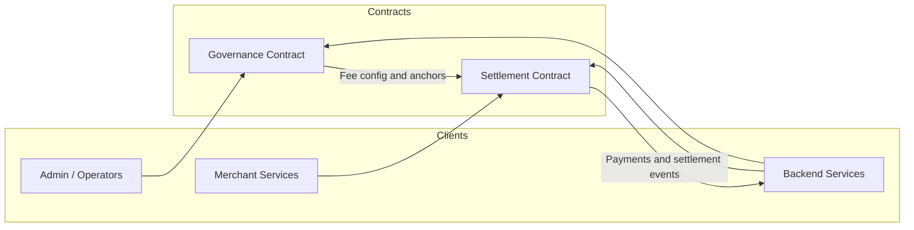

# BettaPay Contracts

Soroban smart contracts for the BettaPay payment infrastructure on Stellar.


## Structure

```
BettaPay-Contract/
├── Cargo.toml                  # Rust workspace root (both contracts)
├── settlement_contract/        # Merchant registration, fee splits, payment references
│   ├── Cargo.toml
│   └── src/lib.rs
├── governance_contract/        # Fee config, anchor registry, system params
│   ├── Cargo.toml
│   └── src/lib.rs
└── scripts/
    ├── deploy_testnet.sh       # Build + deploy both contracts + init admin
    └── simulate.sh             # Simulate contract calls locally
```

## Deployed Addresses (Testnet)

| Contract     | Address                                                  |
|-------------|----------------------------------------------------------|
| Settlement  | `CBGBGKJSUY7XYB6HWW4CVAU6MW2KD25FSF45E5KCP53TKUK374MBZNFB` |
| Governance  | `CDPFWUTIXF5BC6BKNDLSQOZSDQCXAJNZFCZWHBE2RRHANRN25T3ILPZ7` |
| Admin       | `GCCHHKNI7GRA5QWC7RCTT3OHO7SKAUMKQA6IBWEQEO2SXI3GF376UHDD` |

Network: `Test SDF Network ; September 2015`

## Quick Start

```bash
# Run all tests
cargo test

# Build WASM release binaries
cargo build --target wasm32-unknown-unknown --release

# Deploy to testnet (requires soroban CLI)
bash scripts/deploy_testnet.sh
```

## CLI Usage Examples

All examples below assume you have the [Soroban CLI](https://soroban.stellar.org/docs) installed and a funded testnet identity.

### Build

```bash
# Build all contracts (release WASM)
cargo build --target wasm32-unknown-unknown --release

# Build a specific contract
cargo build --target wasm32-unknown-unknown --release -p settlement_contract
cargo build --target wasm32-unknown-unknown --release -p governance_contract
```

### Test

```bash
# Run all tests
cargo test

# Run tests for a specific contract
cargo test -p settlement_contract
cargo test -p governance_contract

# Run a specific test by name
cargo test registers_merchant_and_persists_flag -p settlement_contract
```

### Deploy to Testnet

```bash
# One-command deployment (builds + deploys + initializes both contracts)
bash scripts/deploy_testnet.sh

# Or deploy step-by-step:
# 1. Generate and fund a key
soroban keys generate bettapay-admin --fund

# 2. Build WASM
cargo build --target wasm32-unknown-unknown --release

# 3. Deploy settlement contract
SETTLEMENT_ID=$(soroban contract deploy \
  --wasm target/wasm32-unknown-unknown/release/settlement_contract.wasm \
  --source-account bettapay-admin \
  --rpc-url https://soroban-testnet.stellar.org \
  --network-passphrase "Test SDF Network ; September 2015")

# 4. Deploy governance contract
GOVERNANCE_ID=$(soroban contract deploy \
  --wasm target/wasm32-unknown-unknown/release/governance_contract.wasm \
  --source-account bettapay-admin \
  --rpc-url https://soroban-testnet.stellar.org \
  --network-passphrase "Test SDF Network ; September 2015")

# 5. Initialize both contracts
ADMIN=$(soroban keys address bettapay-admin)

soroban contract invoke \
  --id "$SETTLEMENT_ID" \
  --source-account bettapay-admin \
  --rpc-url https://soroban-testnet.stellar.org \
  --network-passphrase "Test SDF Network ; September 2015" \
  -- \
  init --admin "$ADMIN"

soroban contract invoke \
  --id "$GOVERNANCE_ID" \
  --source-account bettapay-admin \
  --rpc-url https://soroban-testnet.stellar.org \
  --network-passphrase "Test SDF Network ; September 2015" \
  -- \
  init --admin "$ADMIN"
```

### Invoke Settlement Contract

```bash
# Set vars (adjust IDs as needed)
SETTLEMENT_ID=CBGBGKJSUY7XYB6HWW4CVAU6MW2KD25FSF45E5KCP53TKUK374MBZNFB
ADMIN=GCCHHKNI7GRA5QWC7RCTT3OHO7SKAUMKQA6IBWEQEO2SXI3GF376UHDD
MERCHANT=GXXXXXXXXXXXXXXXXXXXXXXXXXXXXXXXXXXXXXXXXXXXXXXXXXXXXXXX
RPC=https://soroban-testnet.stellar.org
PASS="Test SDF Network ; September 2015"

# Check admin
soroban contract invoke --id "$SETTLEMENT_ID" --source-account bettapay-admin \
  --rpc-url "$RPC" --network-passphrase "$PASS" -- \
  get_admin

# Register a merchant
soroban contract invoke --id "$SETTLEMENT_ID" --source-account bettapay-admin \
  --rpc-url "$RPC" --network-passphrase "$PASS" -- \
  register_merchant --merchant "$MERCHANT"

# Check if merchant is registered
soroban contract invoke --id "$SETTLEMENT_ID" --source-account bettapay-admin \
  --rpc-url "$RPC" --network-passphrase "$PASS" -- \
  is_merchant_registered --merchant "$MERCHANT"

# Set a settlement rule (250 bps platform, 50 bps network)
soroban contract invoke --id "$SETTLEMENT_ID" --source-account bettapay-admin \
  --rpc-url "$RPC" --network-passphrase "$PASS" -- \
  set_settlement_rule \
  --merchant "$MERCHANT" \
  --rule '{"platform_fee_bps": 250, "network_fee_bps": 50, "settlement_delay_ledger": 0, "auto_settle": false}'

# Calculate fee split without storing
soroban contract invoke --id "$SETTLEMENT_ID" --source-account bettapay-admin \
  --rpc-url "$RPC" --network-passphrase "$PASS" -- \
  calculate_fee_split --merchant "$MERCHANT" --amount 10000

# Store a payment reference (32-byte hex hash)
soroban contract invoke --id "$SETTLEMENT_ID" --source-account "$MERCHANT" \
  --rpc-url "$RPC" --network-passphrase "$PASS" -- \
  store_payment_reference \
  --merchant "$MERCHANT" \
  --reference "0xabcdef1234567890abcdef1234567890abcdef1234567890abcdef1234567890" \
  --amount 10000

# Fetch a stored payment
soroban contract invoke --id "$SETTLEMENT_ID" --source-account bettapay-admin \
  --rpc-url "$RPC" --network-passphrase "$PASS" -- \
  get_payment_reference \
  --reference "0xabcdef1234567890abcdef1234567890abcdef1234567890abcdef1234567890"

# Set a global default rule
soroban contract invoke --id "$SETTLEMENT_ID" --source-account bettapay-admin \
  --rpc-url "$RPC" --network-passphrase "$PASS" -- \
  set_default_rule \
  --new_rule '{"platform_fee_bps": 100, "network_fee_bps": 0, "settlement_delay_ledger": 0, "auto_settle": false}'

# Pause/unpause
soroban contract invoke --id "$SETTLEMENT_ID" --source-account bettapay-admin \
  --rpc-url "$RPC" --network-passphrase "$PASS" -- \
  pause

soroban contract invoke --id "$SETTLEMENT_ID" --source-account bettapay-admin \
  --rpc-url "$RPC" --network-passphrase "$PASS" -- \
  unpause
```

### Invoke Governance Contract

```bash
GOVERNANCE_ID=CDPFWUTIXF5BC6BKNDLSQOZSDQCXAJNZFCZWHBE2RRHANRN25T3ILPZ7
ASSET=GXXXXXXXXXXXXXXXXXXXXXXXXXXXXXXXXXXXXXXXXXXXXXXXXXXXXXXX
ANCHOR=GXXXXXXXXXXXXXXXXXXXXXXXXXXXXXXXXXXXXXXXXXXXXXXXXXXXXXXX

# Get admin
soroban contract invoke --id "$GOVERNANCE_ID" --source-account bettapay-admin \
  --rpc-url "$RPC" --network-passphrase "$PASS" -- \
  get_admin

# Set fee config (platform 120 bps, network 35 bps)
soroban contract invoke --id "$GOVERNANCE_ID" --source-account bettapay-admin \
  --rpc-url "$RPC" --network-passphrase "$PASS" -- \
  set_fee_config \
  --caller "$ADMIN" \
  --config '{"platform_fee_bps": 120, "network_fee_bps": 35}'

# Read fee config
soroban contract invoke --id "$GOVERNANCE_ID" --source-account bettapay-admin \
  --rpc-url "$RPC" --network-passphrase "$PASS" -- \
  get_fee_config

# Update a system parameter
soroban contract invoke --id "$GOVERNANCE_ID" --source-account bettapay-admin \
  --rpc-url "$RPC" --network-passphrase "$PASS" -- \
  update_system_param --caller "$ADMIN" --key '"max_settle"' --value 1440

# Read a system parameter
soroban contract invoke --id "$GOVERNANCE_ID" --source-account bettapay-admin \
  --rpc-url "$RPC" --network-passphrase "$PASS" -- \
  get_system_param --key '"max_settle"'

# Register an anchor for an asset
soroban contract invoke --id "$GOVERNANCE_ID" --source-account bettapay-admin \
  --rpc-url "$RPC" --network-passphrase "$PASS" -- \
  upsert_anchor --caller "$ADMIN" --asset "$ASSET" --anchor "$ANCHOR"

# Read an anchor
soroban contract invoke --id "$GOVERNANCE_ID" --source-account bettapay-admin \
  --rpc-url "$RPC" --network-passphrase "$PASS" -- \
  get_anchor --asset "$ASSET"

# Remove an anchor
soroban contract invoke --id "$GOVERNANCE_ID" --source-account bettapay-admin \
  --rpc-url "$RPC" --network-passphrase "$PASS" -- \
  remove_anchor --caller "$ADMIN" --asset "$ASSET"

# Transfer admin to a new address
soroban contract invoke --id "$GOVERNANCE_ID" --source-account bettapay-admin \
  --rpc-url "$RPC" --network-passphrase "$PASS" -- \
  transfer_admin --caller "$ADMIN" --new_admin "GYYYYYYYYYYYYYYYYYYYYYYYYYYYYYYYYYYYYYYYYYYYYYYYYYYYYYY"
```

### Local Simulation and Testing

For local development and testing without deploying to testnet, use the `simulate.sh` script:

```bash
# Run complete local simulation (builds, deploys, and initializes both contracts)
bash scripts/simulate.sh

# This outputs contract IDs and source identity:
# Source identity: bettapay-sim
# Source address: GYYYYYYYYYYYYYYYYYYYYYYYYYYYYYYYYYYYYYYYYYYYYYYYYYYYYYY
# Settlement contract ID: CYYYYYYYYYYYYYYYYYYYYYYYYYYYYYYYYYYYYYYYYYYYYYYYYYYYYYY
# Governance contract ID: CYYYYYYYYYYYYYYYYYYYYYYYYYYYYYYYYYYYYYYYYYYYYYYYYYYYYYY
```

After running `simulate.sh`, use the printed contract IDs for local testing:

```bash
# Example: Query settlement contract locally
SETTLEMENT_ID=CYYYYYYYYYYYYYYYYYYYYYYYYYYYYYYYYYYYYYYYYYYYYYYYYYYYYYY
GOVERNANCE_ID=CYYYYYYYYYYYYYYYYYYYYYYYYYYYYYYYYYYYYYYYYYYYYYYYYYYYYYY
SOURCE=bettapay-sim

# Get settlement contract admin
soroban contract invoke --id "$SETTLEMENT_ID" --source-account "$SOURCE" \
  --rpc-url https://soroban-testnet.stellar.org \
  --network-passphrase "Test SDF Network ; September 2015" -- \
  get_admin

# Register a test merchant
TEST_MERCHANT=GXXXXXXXXXXXXXXXXXXXXXXXXXXXXXXXXXXXXXXXXXXXXXXXXXXXXXXX

soroban contract invoke --id "$SETTLEMENT_ID" --source-account "$SOURCE" \
  --rpc-url https://soroban-testnet.stellar.org \
  --network-passphrase "Test SDF Network ; September 2015" -- \
  register_merchant --merchant "$TEST_MERCHANT"
```

### Environment Variable Setup

For repetitive testing, create a local `.env` file or set these variables:

```bash
# Testnet Configuration
export SOROBAN_RPC_URL="https://soroban-testnet.stellar.org"
export SOROBAN_NETWORK_PASSPHRASE="Test SDF Network ; September 2015"
export SOROBAN_ACCOUNT="bettapay-admin"

# Contract Addresses (update after deployment)
export SETTLEMENT_CONTRACT_ID="CBGBGKJSUY7XYB6HWW4CVAU6MW2KD25FSF45E5KCP53TKUK374MBZNFB"
export GOVERNANCE_CONTRACT_ID="CDPFWUTIXF5BC6BKNDLSQOZSDQCXAJNZFCZWHBE2RRHANRN25T3ILPZ7"
export ADMIN_ADDRESS="GCCHHKNI7GRA5QWC7RCTT3OHO7SKAUMKQA6IBWEQEO2SXI3GF376UHDD"

# Use variables in commands:
soroban contract invoke --id "$SETTLEMENT_CONTRACT_ID" --source-account "$SOROBAN_ACCOUNT" \
  --rpc-url "$SOROBAN_RPC_URL" --network-passphrase "$SOROBAN_NETWORK_PASSPHRASE" -- \
  get_admin
```

### Common Tasks

#### Set up a new identity for testing

```bash
# Generate a new key
soroban keys generate test-merchant

# Fund it (Friendbot for testnet)
soroban keys fund test-merchant

# Get its address
MERCHANT_ADDR=$(soroban keys address test-merchant)
echo "Merchant address: $MERCHANT_ADDR"
```

#### Register and configure a merchant

```bash
SETTLEMENT_ID=CBGBGKJSUY7XYB6HWW4CVAU6MW2KD25FSF45E5KCP53TKUK374MBZNFB
ADMIN_ACCOUNT="bettapay-admin"
MERCHANT_ADDR=$(soroban keys address test-merchant)
RPC="https://soroban-testnet.stellar.org"
PASS="Test SDF Network ; September 2015"

# Register merchant
soroban contract invoke --id "$SETTLEMENT_ID" --source-account "$ADMIN_ACCOUNT" \
  --rpc-url "$RPC" --network-passphrase "$PASS" -- \
  register_merchant --merchant "$MERCHANT_ADDR"

# Set settlement rule (e.g., 250 bps platform fee, 50 bps network fee, immediate settlement)
soroban contract invoke --id "$SETTLEMENT_ID" --source-account "$ADMIN_ACCOUNT" \
  --rpc-url "$RPC" --network-passphrase "$PASS" -- \
  set_settlement_rule \
  --merchant "$MERCHANT_ADDR" \
  --rule '{"platform_fee_bps": 250, "network_fee_bps": 50, "settlement_delay_ledger": 0, "auto_settle": false}'

# Verify merchant is registered
soroban contract invoke --id "$SETTLEMENT_ID" --source-account "$ADMIN_ACCOUNT" \
  --rpc-url "$RPC" --network-passphrase "$PASS" -- \
  is_merchant_registered --merchant "$MERCHANT_ADDR"
```

#### Test settlement calculations

```bash
SETTLEMENT_ID=CBGBGKJSUY7XYB6HWW4CVAU6MW2KD25FSF45E5KCP53TKUK374MBZNFB
MERCHANT_ADDR=$(soroban keys address test-merchant)

# Calculate fees for a 10,000 stroops payment
soroban contract invoke --id "$SETTLEMENT_ID" --source-account bettapay-admin \
  --rpc-url "$RPC" --network-passphrase "$PASS" -- \
  calculate_fee_split --merchant "$MERCHANT_ADDR" --amount 10000

# Example output: {platform: 2500, network: 500, merchant: 7000}
```


## Detailed API Specification

This section documents the public entry points, parameter types, return values, authorization rules, and error states for each contract. All financial amounts and fees (bps) are handled using integer types (`i128` and `u32` respectively) to maintain determinism on-chain.

---

### Settlement Contract (`settlement_contract`)

Handles merchant onboarding, rules-based fee splits, and payment references anchor logging.

#### Custom Types & Structs

##### `SettlementRule`
Represents the fee distribution and delay configuration for a specific merchant or as a global default.
```rust
pub struct SettlementRule {
    pub platform_fee_bps: u32,         // Platform fee in basis points (1 bps = 0.01%)
    pub network_fee_bps: u32,          // Network fee in basis points
    pub settlement_delay_ledger: u32,  // Ledger count delay before funds settle
    pub auto_settle: bool,             // Automatic settlement toggle
}
```
**JSON CLI representation:**
```json
{
  "platform_fee_bps": 250,
  "network_fee_bps": 50,
  "settlement_delay_ledger": 0,
  "auto_settle": false
}
```

##### `FeeSplit`
Calculated output for fee distributions.
```rust
pub struct FeeSplit {
    pub gross_amount: i128,          // Total paid amount
    pub platform_fee_amount: i128,   // Platform fee share (rounded up)
    pub network_fee_amount: i128,    // Network fee share (rounded up)
    pub merchant_amount: i128,       // Net merchant payout (remnants)
}
```

##### `PaymentRecord`
Stored record representation for logged payment references.
```rust
pub struct PaymentRecord {
    pub merchant: Address,
    pub amount: i128,
    pub platform_fee_amount: i128,
    pub network_fee_amount: i128,
    pub merchant_amount: i128,
    pub platform_fee_bps: u32,
    pub network_fee_bps: u32,
    pub ledger: u32,
    pub settlement_delay_ledger: u32,
    pub auto_settle: bool,
}
```

#### Settlement API Table

| Function | Inputs | Output | Auth / Guard | Error Panics (`SettlementError`) | Description |
|---|---|---|---|---|---|
| `init` | `admin: Address` | `()` | `admin` | `AlreadyInitialized` | Initializes the contract and stores the administrator. Can only be called once. |
| `get_admin` | None | `Address` | None | `NotInitialized` | Returns the current admin address. |
| `transfer_admin` | `new_admin: Address` | `()` | Stored Admin | `NotInitialized`, `InvalidAddress`, `InvalidAdmin` | Transfers the administrative control to a new address. `new_admin` cannot be zero or the current admin. |
| `pause` | None | `()` | Stored Admin | `NotInitialized`, `Unauthorized` | Halts mutating operations (e.g. register merchant, store payment reference). |
| `unpause` | None | `()` | Stored Admin | `NotInitialized`, `Unauthorized` | Resumes mutating contract operations. |
| `is_paused` | None | `bool` | None | None | Returns whether the contract is currently paused. |
| `register_merchant`| `merchant: Address` | `()` | Stored Admin | `Paused`, `InvalidAddress`, `MerchantExists` | Registers a new merchant. The merchant must not already exist and cannot be the zero address. |
| `unregister_merchant`| `merchant: Address`| `()` | Stored Admin | `Paused`, `MerchantMissing` | Removes a merchant from the registry and deletes their specific rule. |
| `set_settlement_rule`| `merchant: Address`, `rule: SettlementRule` | `()` | Stored Admin | `Paused`, `MerchantMissing`, `InvalidFeeBps`, `InvalidSettlementDelay` | Sets merchant-specific override fees and delay parameters. Sum of bps must be $\le 10,000$. |
| `clear_settlement_rule`| `merchant: Address`| `()` | Stored Admin | `RuleNotSet` | Deletes a merchant-specific rule override, forcing a fallback to the default rules. |
| `set_default_rule` | `new_rule: SettlementRule` | `()` | Stored Admin | `InvalidFeeBps`, `InvalidSettlementDelay` | Configures the global fallback rule applied when no merchant-specific rule exists. |
| `get_default_rule` | None | `Option<SettlementRule>` | None | None | Fetches the global default settlement rule configuration, if any. |
| `store_payment_reference`| `merchant: Address`, `reference: BytesN<32>`, `amount: i128` | `FeeSplit` | `merchant` | `Paused`, `MerchantMissing`, `InvalidPaymentReference`, `InvalidAmount`, `DuplicatePaymentReference` | Records a payment hash on-chain and returns the fee split. `amount` must be $\ge 100$. |
| `is_merchant_registered`| `merchant: Address` | `bool` | None | None | Checks if a merchant is present in the registry. |
| `get_settlement_rule`| `merchant: Address` | `Option<SettlementRule>` | None | None | Reads the merchant-specific settlement rule override. |
| `calculate_fee_split`| `merchant: Address`, `amount: i128` | `FeeSplit` | None | `MerchantMissing`, `InvalidAmount` | Performs a dry-run calculation of fees for the merchant without mutating storage. |
| `get_payment_reference`| `reference: BytesN<32>` | `Option<PaymentRecord>` | None | None | Returns the logged payment record. Refreshes the entry's TTL when queried. |
| `get_payments` | `references: Vec<BytesN<32>>` | `Vec<PaymentRecord>` | None | None | Batch retrieves logged payment records. Missing references are ignored. |

---

### Governance Contract (`governance_contract`)

Controls protocol-wide parameters, fee limits, upgraded code hashes, and trust anchors.

#### Custom Types & Structs

##### `FeeConfig`
Represents the default protocol fees.
```rust
pub struct FeeConfig {
    pub platform_fee_bps: u32, // Bounded by MIN_FEE_BPS (5) and MAX_FEE_BPS (5,000)
    pub network_fee_bps: u32,  // Combined sum must be <= 10,000 bps
}
```

##### `AdminTransferred`
Event payload structure for administrative transfer tracking.
```rust
pub struct AdminTransferred {
    pub old_admin: Address,
    pub new_admin: Address,
}
```

#### Governance API Table

| Function | Inputs | Output | Auth / Guard | Error Panics (`GovernanceError`) | Description |
|---|---|---|---|---|---|
| `init` | `admin: Address` | `()` | `admin` | `AlreadyInitialized` | Initializes the governance contract and sets the administrator. |
| `is_initialized` | None | `bool` | None | None | Returns `true` if initialization has been completed. |
| `get_admin` | None | `Address` | None | `NotInitialized` | Returns the current admin address. |
| `upgrade` | `caller: Address`, `new_wasm_hash: BytesN<32>` | `()` | `caller == admin` | `Unauthorized` | Replaces the contract Wasm code with a new binary, leaving storage unchanged. |
| `transfer_admin` | `_caller: Address`, `new_admin: Address` | `()` | Stored Admin | `InvalidAdmin` | Assigns the admin role to `new_admin`. Address cannot be zero or the current admin. |
| `pause` | `caller: Address` | `()` | `caller == admin` | `Unauthorized` | Halts mutating governance config operations. |
| `unpause` | `caller: Address` | `()` | `caller == admin` | `Unauthorized` | Resumes governance operations. |
| `is_paused` | None | `bool` | None | None | Returns whether the governance modifications are halted. |
| `update_system_param` | `caller: Address`, `key: Symbol`, `value: i128` | `()` | `caller == admin` | `Unauthorized`, `InvalidParamValue` | Stores or overrides a numeric parameter `value` (must be $\ge 0$) under `key`. |
| `get_system_param` | `key: Symbol` | `Option<i128>` | None | None | Fetches the system parameter value. Refreshes storage TTL on reads. |
| `set_fee_config` | `caller: Address`, `config: FeeConfig` | `()` | `caller == admin` | `Unauthorized`, `InvalidFeeBps` | Updates the global default fee configuration. Limits: $5 \text{ bps} \le \text{bps} \le 5000 \text{ bps}$. |
| `get_fee_config` | None | `Option<FeeConfig>` | None | None | Fetches the active system fee config. |
| `upsert_anchor` | `caller: Address`, `asset: Address`, `anchor: Address` | `()` | `caller == admin` | `Unauthorized` | Registers or updates a trusted off-chain anchor address for a token asset. |
| `remove_anchor` | `caller: Address`, `asset: Address` | `()` | `caller == admin` | `Unauthorized`, `AnchorMissing` | Removes the trusted anchor config for a token asset. |
| `get_anchor` | `asset: Address` | `Option<Address>` | None | None | Reads the trusted anchor address associated with an asset. |

---


## Architecture Diagram



This diagram highlights the main interaction pattern: the backend and operators call the contracts directly, while the settlement contract consumes governance configuration and emits settlement-related events back to the application layer.

## Soroban SDK Version

`soroban-sdk = "21.7.7"`

## Dependencies

No cross-contract calls. Both contracts are independently deployable and stateless across each other. The backend services call them via Stellar RPC.

i would like to work on this issue
