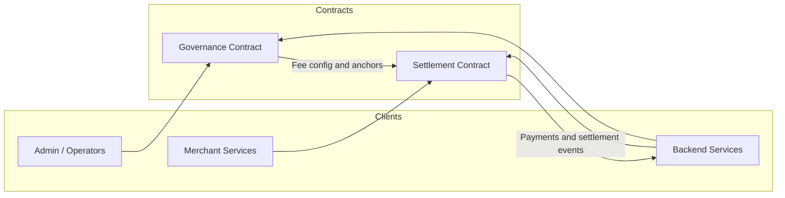

# BettaPay Contracts

Soroban smart contracts for the BettaPay payment infrastructure on Stellar.


## Structure

```
BettaPay-Contract/
├── Cargo.toml                  # Rust workspace root (both contracts)
├── settlement_contract/        # Merchant registration, fee splits, payment references
│   ├── Cargo.toml
│   └── src/lib.rs
├── governance_contract/        # Fee config, anchor registry, system params
│   ├── Cargo.toml
│   └── src/lib.rs
└── scripts/
    ├── deploy_testnet.sh       # Build + deploy both contracts + init admin
    └── simulate.sh             # Simulate contract calls locally
```

## Deployed Addresses (Testnet)

| Contract     | Address                                                  |
|-------------|----------------------------------------------------------|
| Settlement  | `CBGBGKJSUY7XYB6HWW4CVAU6MW2KD25FSF45E5KCP53TKUK374MBZNFB` |
| Governance  | `CDPFWUTIXF5BC6BKNDLSQOZSDQCXAJNZFCZWHBE2RRHANRN25T3ILPZ7` |
| Admin       | `GCCHHKNI7GRA5QWC7RCTT3OHO7SKAUMKQA6IBWEQEO2SXI3GF376UHDD` |

Network: `Test SDF Network ; September 2015`

## Quick Start

```bash
# Run all tests
cargo test

# Build WASM release binaries
cargo build --target wasm32-unknown-unknown --release

# Deploy to testnet (requires soroban CLI)
bash scripts/deploy_testnet.sh
```

## Contract Overview

### settlement_contract

Handles the on-chain settlement layer:
- `init(admin)` — one-time initialization, sets admin
- `register_merchant(merchant)` — admin registers a merchant address
- `set_settlement_rule(merchant, rule)` — admin sets fee BPS and settlement config
- `store_payment_reference(merchant, reference, amount)` — merchant anchors a payment hash on-chain, emits events, calculates fee split
- `calculate_fee_split(merchant, amount)` — read-only fee split calculation
- `get_payment_reference(reference)` — fetch stored payment record
- `is_merchant_registered(merchant)` — boolean check
"all done"
Handles protocol-level configuration:
- `init(admin)` — one-time initialization
- `set_fee_config(config)` — admin sets platform + network fee BPS
- `get_fee_config()` — read current fee config
- `update_system_param(key, value)` — generic key/value system config
- `get_system_param(key)` — read system param
- `upsert_anchor(asset, anchor)` — register/update anchor for asset
- `remove_anchor(asset)` — remove anchor
- `get_anchor(asset)` — read anchor for asset

## Architecture Diagram



This diagram highlights the main interaction pattern: the backend and operators call the contracts directly, while the settlement contract consumes governance configuration and emits settlement-related events back to the application layer.

## Soroban SDK Version

`soroban-sdk = "21.7.7"`

## Dependencies

No cross-contract calls. Both contracts are independently deployable and stateless across each other. The backend services call them via Stellar RPC.

i would like to work on this issue
